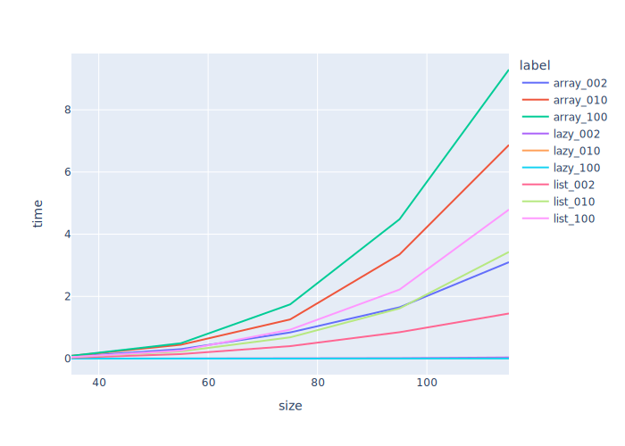

# Performance

## The Problem

-   Speed doesn't always matter, but when it does, it really does
-   There are widely-useful techniques for improving performance (e.g., spending memory to save time)
-   *We can and should tackle this experimentally*
    -   If "software engineering" means anything, it ought to mean this

---

## Reproducibility

-   Use `dataclasses` module to create a `Params` class in `params_single.py`
    -   Could use a dictionary or similar instead
    -   But this is a step toward something larger
-   Can now save parameters in version control

```{data-file="params_single.py:paramssingle"}
@dataclass
class ParamsSingle:
    """A single set of invasion percolation parameters."""

    kind: str
    width: int
    height: int
    depth: int
    seed: int = None
```

---

## Saving Prameters

-   Load parameters from JSON file
    -   Could easily use YAML instead
    -   [Spread](g:spread) values into dataclass constructor

```{data-file="invperc_util.py:get_params"}
def get_params(filename, cls):
    """Get parameters."""
    with open(filename, "r") as reader:
        d = json.load(reader)
        return cls(**d)
```

---

## Using Parameters

-   Modify code in `invperc_single.py` to use these parameters

```{data-file="invperc_single.py:main"}
def main():
    """Main driver."""
    params = get_params(sys.argv[1], ParamsSingle)
    initialize_random(params)
    grid = initialize_grid(params)
    num_filled = grid.fill()
    if len(sys.argv) > 2:
        print_grid(params, grid, num_filled, details="full")
```

-   Would be nice if there was a standard way to embed parameters in the plot itself

---

## Performance

-   Application's performance usually depends on what exactly it's doing
    -   So we [sweep](g:parameter_sweeping) the range of parameters to see how performance changes
-   Create another dataclass to store multiple values for interesting parameters

```{data-file="params_sweep.py:paramssweep"}
@dataclass
class ParamsSweep:
    """A range of invasion percolation parameters."""

    kind: list[str]
    size: list[int]
    depth: list[int]
    runs: int
    seed: int = None
```

---

## Sweeping Parameter Ranges

-   Next, rewrite `main` to try each combination of parameter values

```{data-file="invperc_sweep.py:main"}
def main():
    """Main driver."""
    params = get_params(sys.argv[1], ParamsSweep)
    initialize_random(params)
    results = []
    for p in generate_sweep(params):
        print(p)
        grid = initialize_grid(p)
        t_start = time.time()
        num_filled = grid.fill()
        t_elapsed = time.time() - t_start
        results.append(record_result(p, num_filled, t_elapsed))
    save_results(params, results)
```

---

## Generators

-   Could generate a list of parameter combinations
-   Instead, use a [generator](g:generator) to produce one at a time

```{data-file="invperc_sweep.py:generate_sweep"}
def generate_sweep(params):
    """Generate next single parameter object."""
    for kind in params.kind:
        for size in params.size:
            for depth in params.depth:
                for run in range(params.runs):
                    yield ParamsSingle(kind, size, size, depth)
```

---

## Results

-   Save results as CSV and plot

<figure id="perf_example">
  
  <figcaption>Line graph showing that running time increases quadratically with grid size.</figcaption>
</figure>

---

## That's a Surprise

-   NumPy array is *worse* than list-of-lists
    -   We're constantly [boxing](g:boxing) and [unboxing](g:unboxing) values
-   More important: runtime is growing faster than linear
    -   Which makes sense: we are searching \\( N^2 \\) cells each time we fill one

---

## Profiling

-   A [profiler](g:profiler) records how much time is spent on each line of code
    -   Either by instrumenting it
    -   Or by sampling location periodically
-   Use Python's [`cProfile`][profile] module

```{data-file="run_profile_list.py:main"}
sys.argv = ["invperc_single.py", "profile_list.json"]
cProfile.run("main()", sort="tottime")
```

---

## Where the Time Goes

```{data-file="profile_list_head.txt"}
         13885219 function calls in 3.169 seconds

   Ordered by: internal time

   ncalls  tottime  percall  cumtime  percall filename:lineno(function)
  1794596    1.541    0.000    2.443    0.000 grid_generic.py:47(adjacent)
  8601051    0.872    0.000    0.872    0.000 grid_list.py:20(__getitem__)
      356    0.551    0.002    3.161    0.009 invperc_util.py:12(choose_cell)
  1708120    0.101    0.000    0.101    0.000 grid_generic.py:39(height)
  1731763    0.096    0.000    0.096    0.000 grid_generic.py:35(width)
…more lines…
```

-   We are spending most of our time in adjacency tests
    -   Most of which are re-checking things we knew before
-   If we want to make our program faster, this is what we need to fix

---

## Better is Possible

-   Start with the punchline and work backward

<figure id="perf_lazy">
  
  <figcaption>Line graph showing that the lazy algorithm's performance is nearly flat.</figcaption>
</figure>

---

## Lazy Evaluation

-   We have been searching the entire grid to find the next cell to fill
    -   But we only need to look on the border
    -   And we can keep track of where the border is
-   Keep a dictionary called `candidates`
    -   Key: a value in the grid
    -   Values: coordinates of cells on the border that have that value
-   On each step:
    -   Find the lowest key
    -   Choose and fill of its cells at random to eliminate the bias of [the previous chapter](../04_cleanup/index.md)
    -   Add its unfilled neighbors to `candidates`
-   Trading space for time
    -   Storing cell values and coordinates is redundant
    -   But filling a cell now takes constant time regardless of grid size

---

## A Lazy Grid

-   `GridLazy` constructor

```{data-file="grid_lazy.py:init"}
    def __init__(self, width, height, depth):
        """Construct and fill."""
        super().__init__(width, height, depth)
        self._candidates = {}
    ```

---

## Lazy Filling

-   Filling algorithm overrides inherited method
    -   Fill the center cell
    -   Add its neighbors as candidates
    -   Repeatedly choose a cell to fill (stopping if we've reached the boundary)

```{data-file="grid_lazy.py:fill"}
    def fill(self):
        """Fill grid one cell at a time."""
        x, y = self.width() // 2, self.height() // 2
        self[x, y] = 0
        num_filled = 1
        self.add_candidates(x, y)

        while True:
            x, y = self.choose_cell()
            self[x, y] = 0
            num_filled += 1
            if self.on_border(x, y):
                break
        return num_filled
    ```

---

## Adding Candidates

```{data-file="grid_lazy.py:add_candidates"}
    def add_candidates(self, x, y):
        """Add candidates around (x, y)."""
        for ix in (x - 1, x + 1):
            self.add_one_candidate(ix, y)
        for iy in (y - 1, y + 1):
            self.add_one_candidate(x, iy)
    ```
```{data-file="grid_lazy.py:add_one_candidate"}
    def add_one_candidate(self, x, y):
        """Add (x, y) if suitable."""
        if (x < 0) or (x >= self.width()) or (y < 0) or (y >= self.height()):
            return
        if self[x, y] == 0:
            return

        value = self[x, y]
        if value not in self._candidates:
            self._candidates[value] = set()
        self._candidates[value].add((x, y))
    ```

---

## Choosing a Cell

```{data-file="grid_lazy.py:choose_cell"}
    def choose_cell(self):
        """Choose the next cell to fill."""
        min_key = min(self._candidates.keys())
        available = list(sorted(self._candidates[min_key]))
        i = random.randrange(len(available))
        choice = available[i]
        del available[i]
        if not available:
            del self._candidates[min_key]
        else:
            self._candidates[min_key] = set(available)
        self.add_candidates(*choice)
        return choice
    ```

---

## It's Faster

-   Sweep the same parameter ranges as before
-   Performance is much better
    -   Searching an \\( N{\times}N \\) grid is \\( N^2 \\) operations
    -   Fill about \\( N^{1.5} \\) cells (it's a fractal)
    -   So running time of the naïve approach is proportional to \\( N^{3.5} \\)
    -   Which a computer scientist would write \\( \mathcal{O}(N^{3.5}) \\)
    -   Running time of lazy approach is just \\( \mathcal{O}(N^{1.5}) \\)
-   So it is *fundamentally* faster

---

## Exercises {: #lazy-exercises}

1.  FIXME: add exercises for performance profiling

1.  Modify the list and array implementation to collect candidate cells of equal lowest value
    and select one of those.

1.  Does it make sense to pre-populate `candidates` by adding *all* cells in the grid
    at the start of the program?
    Why or why not?

1.  FIXME: test lazy approach with randomnmess
