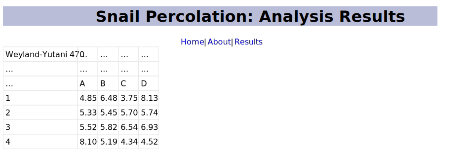

# A Static Web Site

-   Sharing knowledge is the last and most important step of scientific research
-   Journals may require a PDF, but a website will get more readers
-   Use a [static](g:ssg)e generator" %] to create one
-   We will use [Ark][ark] (the same tool used to create this site)

## Site Elements {: #website-elements}

-   Configuration file `config.py` in root directory
    -   Some SSGs use YAML files, then need workarounds for conditionals etc.

```{data-file="../example_site/config.py"}
"""Ark configuration file."""

title = "Snail Percolation"
data_dir = "data"

theme = "snails"
src_dir = "src"
out_dir = "docs"
extension = "/"

markdown_settings = {
    "extensions": [
        "markdown.extensions.extra",
        "markdown.extensions.smarty",
        "pymdownx.superfences",
    ]
}
```

-   [Theme](g:ssg_theme) lives in <code>lib/<em>theme</em></code>
    -   `extensions`: Python to add features (discussed below)
    -   `resources`: CSS and image files copied over as-is
    -   `templates`: for controlling page layout

-   Markdown files with `.md` extension are turned into HTML

```{data-file="../example_site/src/index.md"}
This is the home page.
```

-   Transformation relies on a [template](g:ssg_template)
-   We use [Jinja][jinja]

```{data-file="../example_site/lib/snails/templates/node.jinja"}
<!DOCTYPE html>
<html lang="en">
  <head>
    <link rel="stylesheet" href="@root/style.css">
    <title>{{ site.title }}: {{ node.title }}</title>
  </head>
  <body>
    <div class="row">
      <div class="col-11">
	<h1>{{ site.title }}: {{ node.title }}</h1>
	{{ inc.menu }}
      </div>
      <div class="col-1">
	<p>
	  
	</p>
      </div>
    </div>
{{ node.html }}
  </body>
</html>
```

-   `@root` is turned into the path to the root of the generated site
-   <code></code> is [interpolated](g:interpolation)
    -   <code>site.<em>name</em></code> picks up variables from site configuration
    -   <code>page.<em>name</em></code> picks up variables from page header
    -   <code>…</code> is conditional

```{data-file="../example_site/src/credits.md"}
---
title: Credits
---

-   Snail logo by [anarres](https://openclipart.org/artist/anarres)
```

## Customizing {: #website-customize}

-   SSGs weren't designed with researchers' needs in mind
-   Write our own extensions for things we need and register them as [shortcodes](g:shortcode)
-   What we want:

```{data-file="../example_site/src/result.md"}
---
title: Analysis Results
---

[%csv 3fd8cbb7.csv %]
```

-   Code for the extension

```{data-file="../example_site/lib/snails/extensions/codes.py:display_csv"}
@shortcodes.register("csv")
def display_csv(pargs, kwargs, node):
    """Handle [%csv filename %] table inclusion."""
    assert (len(pargs) == 1) and (
        not kwargs
    ), f"Bad 'csv' shortcode with {pargs} and {kwargs} in {node}"
    filepath = Path(ark.site.config["data_dir"], pargs[0])
    assert filepath.exists(), f"CSV file {filepath} not found"
    with open(filepath, "r") as raw:
        rows = [[val if val else "…" for val in row] for row in csv.reader(raw)]
    tbl = PrettyTable(header=False)
    tbl.add_rows(rows)
    return tbl.get_html_string()
```

<figure id="webiste_screenshot">
  
  <figcaption>Generated page.</figcaption>
</figure>
