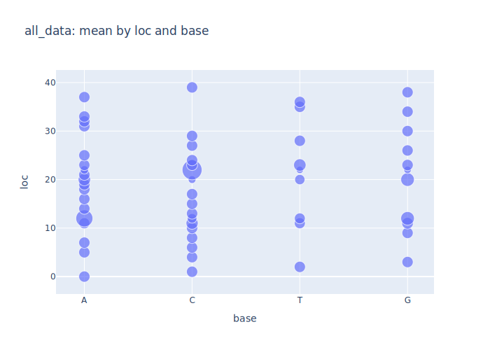
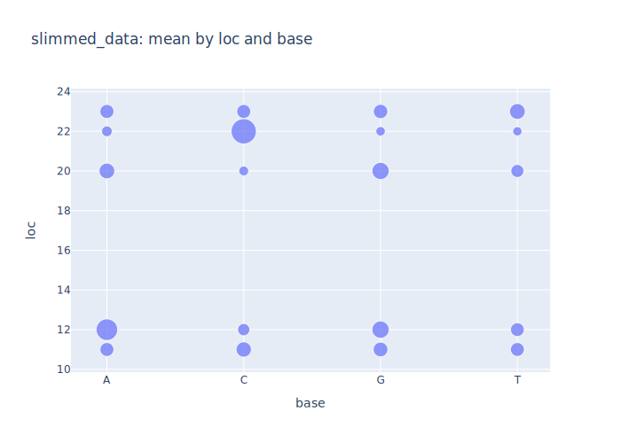
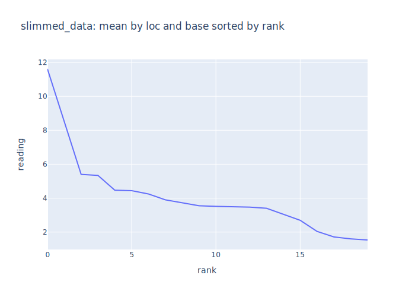

# Synthetic Data

## The Problem

-   How do you test a data analysis pipeline?
    -   Unit tests of the kind used for invasion percolation aren't necessarily appropriate
    -   Problem isn't the control flow of the code but how it interacts with data
-   [Alexander2023](b:Alexander2023): build a [synthetic data generator](g:synth_data)
    -   Check the behavior of the pipeline by pushing data with known properties through it
    -   If it finds something statistically significant in white noise, rethink the pipeline
-   [Faker][faker] has tools for generating a lot of useful data (we will use it in future chapters)
-   But it can't generate genomes, so we'll build our own

FIXME: replace pandas with polars

---

## Synthesizing Genomes

-   Create some short snail genomes with [single nucleotide polymorphisms](g:snp)
-   Output will have:
    -   Length: for now, all sequences the same length)
    -   Reference sequence: the unmutated original
    -   Locations: where mutations can occur
    -   Susceptible location and base: which of those locations is the key to variance,
        and what mutated base causes the visible mutation
    -   Individuals: list of generated genomes
-   Since this has multiple fields, store as JSON

---

## Main Driver

```{data-file="synthesize_genomes.py:main"}
def main():
    """Main driver."""
    args = parse_args()
    random.seed(args.seed)
    genomes = random_genomes(
        args.length,
        args.num_genomes,
        args.num_snp,
        args.prob_other,
    )
    add_susceptibility(genomes)
    save(args.outfile, genomes)
```

---

## Random Genomes

-   Create a random base sequence as the reference genome
-   Create duplicates for individuals
-   Determine where SNPs can occur
-   Introduce significant mutations
-   Introduce other random mutations
-   Sort for reproducibility [Taschuk2017](b:Taschuk2017)

---

## Random Genomes

```{data-file="synthesize_genomes.py:random_genomes"}
def random_genomes(length, num_genomes, num_snp, prob_other):
    """Generate a set of genomes with specified number of point mutations."""
    assert 0 <= num_snp <= length

    # Reference genomes and specific genomes to modify.
    reference = random_bases(length)
    individuals = [reference] * num_genomes

    # Locations for SNPs.
    locations = random.sample(list(range(length)), num_snp)

    # Introduce significant mutations.
    for loc in locations:
        candidates = _other_bases(reference, loc)
        bases = [reference[loc]] + random.sample(candidates, k=len(candidates))
        individuals = [_mutate_snps(reference, ind, loc, bases) for ind in individuals]

    # Introduce other random mutations.
    other_locations = list(set(range(length)) - set(locations))
    individuals = [
        _mutate_other(ind, prob_other, other_locations) for ind in individuals
    ]

    # Return structure.
    individuals.sort()
    locations.sort()
    return GenePool(
        length=length, reference=reference, individuals=individuals, locations=locations
    )
```

---

## Random Bases and Mutations

```{data-file="synthesize_genomes.py:random_bases"}
def random_bases(length):
    """Generate a random sequence of bases of the specified length."""
    assert 0 < length
    return "".join(random.choices(DNA, k=length))
```
```{data-file="synthesize_genomes.py:mutate_snps"}
def _mutate_snps(reference, genome, loc, bases):
    """Introduce single nucleotide polymorphisms at the specified location."""
    choice = _choose_one(bases, SNP_PROBS)
    return genome[:loc] + choice + genome[loc + 1 :]
```
```{data-file="synthesize_genomes.py:mutate_other"}
def _mutate_other(genome, prob, locations):
    """Introduce other mutations at specified locations."""
    if random.random() > prob:
        return genome
    loc = random.sample(locations, k=1)[0]
    base = random.choice(_other_bases(genome, loc))
    genome = genome[:loc] + base + genome[loc + 1 :]
    return genome
```

---

## Synthesizing Samples

-   Our model is that snail size depends on:
    -   Presence of significant mutation
    -   Distance from epicenter of pollution
-   Building this forces us to be explicit about our model
    -   Variance depends on a single nucleotide
    -   And on linear distance from a center point
-   So:
    -   Load the individuals
    -   Put each individual somewhere near the spill site
    -   Generate a random reading for its size that depends on two factors

---

## Once More With Feeling

-   Main driver should be starting to look familiar

```{data-file="synthesize_samples.py:main"}
def main():
    """Main driver."""
    args = parse_args()
    random.seed(args.seed)
    genomes = json.loads(Path(args.genomes).read_text())
    geo_params = get_geo_params(args)
    samples = generate_samples(args, genomes, geo_params)
    save(args, samples)
```

---

## Geography

-   Get geographic parameters from CSV files
-   Need to join tables to get longitude, latitude, and nominal pollution radius

```{data-file="sites.csv"}
site,lon,lat
COW,-124.04519,48.82172
YOU,-124.197,48.87251
HMB,-124.17555,48.81673
GBY,-124.4593,48.9209
```
```{data-file="surveys.csv"}
label,site,date,num,peak,relative_sd,radius
1748,COW,2023-04-27,23,100.0,0.1,0.1
1749,COW,2023-04-28,11,100.0,0.1,0.1
1755,COW,2023-05-13,15,101.0,0.11,0.1
1781,YOU,2023-05-01,12,90.0,0.15,0.15
1790,HMB,2023-05-02,19,107.0,0.22,0.11
1803,GBY,2023-05-08,8,95.0,0.1,0.14
```

---

## Geography

```{data-file="synthesize_samples.py:get_geo_params"}
def get_geo_params(args):
    """Get geographic parameters."""
    sites = pd.read_csv(Path(args.paramsdir, "sites.csv"))
    surveys = pd.read_csv(Path(args.paramsdir, "surveys.csv"))
    combined = sites.merge(surveys, how="inner", on="site")
    filtered = combined[combined["site"] == args.site].iloc[0]
    return {
        "lon": filtered["lon"],
        "lat": filtered["lat"],
        "radius": filtered["radius"],
    }
```

---

## Generate Locations and Sizes

-   Generate location and snail size based on genetics and distance

```{data-file="synthesize_samples.py:generate_samples"}
def generate_samples(args, genomes, geo_params):
    """Generate snail samples."""
    samples = []
    for sequence in genomes["individuals"]:
        point, distance = random_geo_point(**geo_params)
        if sequence[genomes["susceptible_loc"]] == genomes["susceptible_base"]:
            limit = args.mutant
        else:
            limit = args.normal
        scale = limit * distance / geo_params["radius"]
        reading = random.uniform(
            MIN_SNAIL_SIZE, MIN_SNAIL_SIZE + MAX_SNAIL_SIZE * scale
        )
        samples.append((point.longitude, point.latitude, sequence, reading))

    df = pd.DataFrame(samples, columns=("lon", "lat", "sequence", "reading"))
    df["lon"] = df["lon"].round(LON_LAT_PRECISION)
    df["lat"] = df["lat"].round(LON_LAT_PRECISION)
    df["reading"] = df["reading"].round(SNAIL_PRECISION)

    return df
```

---

## Magic Numbers

-   Keep the magic numbers at the top of the file
    -   If we wanted to vary these, would store them as JSON or YAML and load
    -   In particular, would do this if we were sweeping parameters as in [the earlier chapter](../06_scale/index.md)

```{data-file="synthesize_samples.py:parameters"}
CIRCLE = 360.0
LON_LAT_PRECISION = 5
READING_PRECISION = 1
MIN_SNAIL_SIZE = 0.5
MAX_SNAIL_SIZE = 5.0
SNAIL_PRECISION = 1
```

---

## Analysis

-   Finally ready to write our analysis
-   Read the CSV data with locations, genomes, and readings
-   Find all candidate locations where sequences don't agree
-   Create a scatter plot by location and base
    -   One showing all data
    -   One showing only locations where there are variations

---

## All Our Snails

<figure id="mutate_all_scatter">
  
  <figcaption>Figure 1: Reading as a function of location and base (all)</figcaption>
</figure>

---

## Snails With Mutations

<figure id="mutate_slimmed_scatter">
  
  <figcaption>Figure 2: Reading as a function of location and base (mutants)</figcaption>
</figure>

---

## Rank Order

<figure id="mutate_slimmed_sorted">
  
  <figcaption>Figure 3: Reading as a function of location (rank order)</figcaption>
</figure>

---

## Conclusions

-   Clearly a winner in this plot…
-   …but not nearly as clear in scatter plot…
-   …and the winner has only twice the reading of the next-highest (random) value
-   Statistics could tell us if this is what we expect,
    but this isn't a statistics lesson

---

## Exercises

FIXME: create exercises for data analysis chapter
